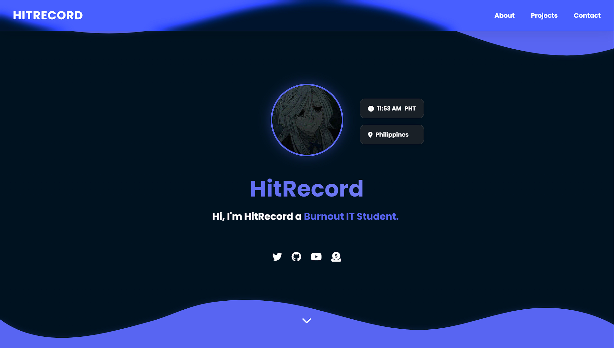

# HitRecord's Portfolio Website

<div align="center">
  
  
  [](https://h1trecord.github.io/Portfolio-Website)
  [](LICENSE)
</div>

## ✨ Features

- **Modern Design**
  - Glass-morphism UI elements
  - Responsive layout for all devices
  - Dynamic wave animations
  - Clean typography with Poppins font

- **Interactive Elements**
  - Smooth scroll animations
  - Dynamic typing effect
  - Real-time clock with PHT timezone
  - Hover effects and transitions

- **Developer-Friendly**
  - Component-based architecture
  - Well-organized file structure
  - Easy to customize and extend
  - Optimized performance

## 🛠️ Tech Stack

- **Frontend Framework:** React 18 with Vite
- **Styling:** CSS3 with Custom Properties
- **Animations:** Custom CSS animations
- **Icons:** Font Awesome 6
- **Deployment:** GitHub Pages

## 🚀 Quick Start

1. **Clone and Install**
   ```bash
   git clone https://h1trecord.github.io/Portfolio-Website.git
   cd Portfolio-Website
   npm install
   ```

2. **Development**
   ```bash
   npm run dev
   # Server starts on http://localhost:5173
   ```

3. **Build**
   ```bash
   npm run build
   npm run preview
   ```

## 📁 Project Structure

## 🔧 Environment Setup

Ensure you have the following installed:
- Node.js (v14+ recommended)
- npm or yarn
- Git

## 🎨 Customization

1. Update the profile information in `components`
2. Modify colors in `styles`
3. Add your projects in the projects section
4. Update social media links

## 📝 License

This project is open source and available under the [MIT License](LICENSE)

## 🙏 Credits

- Wave animations inspired by various creative developers
- Icons from Font Awesome
- Animations powered by Framer Motion

## 🤝 Contributing

Contributions, issues, and feature requests are welcome! Feel free to check the [issues page](https://github.com/H1tRecord/Portfolio-Website/issues).

## 📬 Contact

- GitHub: [@H1tRecord](https://github.com/H1tRecord)
- Twitter: [@HitRedcord](https://twitter.com/HitRedcord)
- YouTube: [@hitrecordyt](https://www.youtube.com/@hitrecordyt)
- Ko-fi: [HitRecord](https://ko-fi.com/hitrecord)
